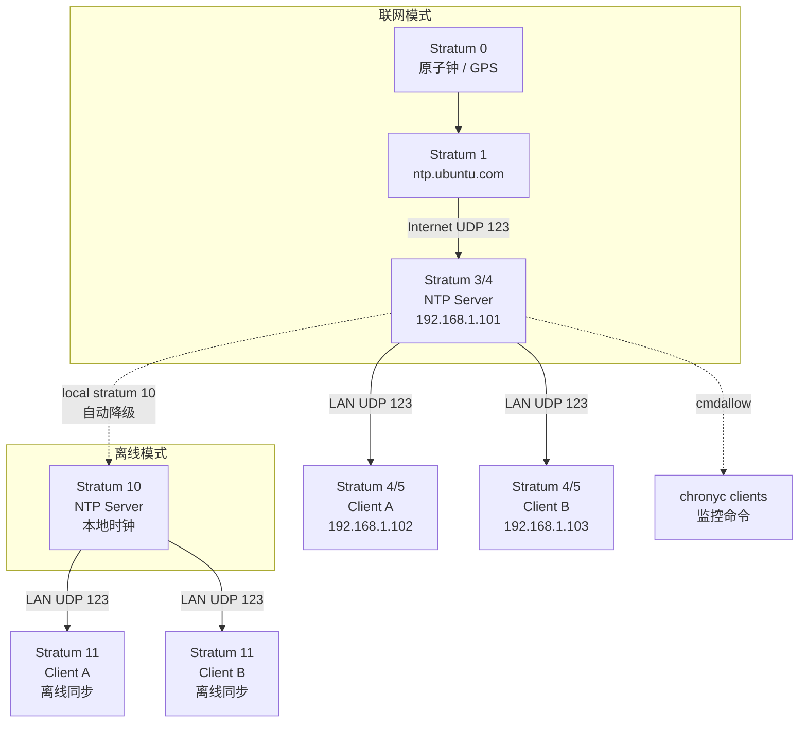

# NTP 时间同步配置指南

> 本文档介绍基于 **chrony** 的局域网 NTP 时间同步方案，适用于多机分布式系统（如 Legion 框架）的时间一致性保障。

---

## 一、原理介绍

### 1.1 为什么需要时间同步

在分布式系统中，各节点独立运行各自的硬件时钟。由于晶振频率存在微小差异，长时间运行后节点间会产生明显的时间偏差。时间不同步会导致：

- **日志时序混乱**：跨节点日志无法按正确时间排序
- **消息排序错误**：ROS/DDS 等中间件依赖时间戳进行消息排序
- **数据融合失效**：传感器数据时间戳不一致导致融合算法异常
- **安全认证失败**：证书有效期、Token 过期等依赖准确时间

### 1.2 NTP 层级模型（Stratum）

NTP 采用层级架构，用 **Stratum** 表示时钟源与原子钟的距离：

| Stratum | 含义 | 精度 |
|---------|------|------|
| 0 | 原子钟 / GPS / 无线电时钟（参考源，不通过网络分发） | 最高 |
| 1 | 直接与 Stratum 0 连接的服务器 | ~微秒级 |
| 2 | 与 Stratum 1 同步的服务器 | ~毫秒级 |
| 3 | 与 Stratum 2 同步的服务器 | ~毫秒级 |
| 4~15 | 逐级向下同步 | 依次递减 |
| 16 | 未同步状态 | — |

> **Legion 框架场景**：本机作为 Stratum 3/4 服务器，A/B 作为 Stratum 4/5 客户端，完全满足毫秒级同步需求。

### 1.3 核心概念

| 术语 | 说明 |
|------|------|
| **Offset** | 本地时钟与 NTP 服务器时钟的偏差（目标是将此值收敛到 0） |
| **Delay** | 网络往返时延（Round-Trip Time），影响同步精度上限 |
| **Jitter** | 多次同步中 Offset 的波动程度，反映网络稳定性 |
| **Poll** | 轮询间隔（单位：秒，实际值为 2^Poll 秒），chrony 会动态调整 |
| **Reach** | 最近 8 次轮询的成功 bitmap（377 = 0b11111111 表示全部成功） |
| **Step** | 跳跃式调整时钟（一次性跳变，用于大偏差） |
| **Slew** | 渐进式调整时钟（微调频率，用于小偏差，不影响正在运行的程序） |

### 1.4 chrony vs ntpd vs systemd-timesyncd

| 特性 | chrony | ntpd | systemd-timesyncd |
|------|--------|------|-------------------|
| 适用场景 | 服务器 / 间歇联网 / 高精度 | 传统持续联网 | 简单客户端-only |
| 大偏差处理 | `makestep` 可配置立即同步 | 默认需 128ms 才 step | 仅 slew |
| 离线补偿 | 优秀（利用 driftfile） | 一般 | 无 |
| 配置复杂度 | 简单 | 较复杂 | 极简 |
| 推荐度 | ⭐⭐⭐⭐⭐ | ⭐⭐⭐ | ⭐⭐ |

> **建议**：多机分布式场景统一使用 **chrony**。

---

## 二、拓扑结构

本方案采用 **星型拓扑**，以局域网内一台机器作为 NTP Server，其余机器作为 NTP Client 进行时间同步。

### 2.1 双模式拓扑（核心设计）

本方案的关键设计是 **Server 端自动在「联网模式」和「离线模式」间切换**，Client 端无感知。

#### 模式一：联网模式（公网可用）

```
                         ┌──────────────────────────────────────┐
                         │         Internet / 公网              │
                         │  pool.ntp.ubuntu.com (Stratum 1~2) │
                         └──────────────┬───────────────────────┘
                                        │ UDP 123
                                        ▼
                         ┌──────────────────────────────────────┐
                         │   NTP Server (本机)                  │
                         │   192.168.1.101                      │
                         │   Stratum 3/4  ◄── 从公网校准       │
                         │   chrony.conf: allow 192.168.1.0/24  │
                         └──────────────┬───────────────────────┘
                                        │ UDP 123
                          ┌─────────────┴─────────────┐
                          │                           │
                          ▼                           ▼
           ┌────────────────────────┐    ┌────────────────────────┐
           │   NTP Client (A)       │    │   NTP Client (B)       │
           │   192.168.1.102        │    │   192.168.1.103        │
           │   Stratum 4/5          │    │   Stratum 4/5          │
           │   时间 = 公网标准时间   │    │   时间 = 公网标准时间   │
           └────────────────────────┘    └────────────────────────┘
```

#### 模式二：离线模式（公网断开）

```
                         ┌──────────────────────────────────────┐
                         │         Internet / 公网              │
                         │        ❌ 不可达 / 断开              │
                         └──────────────────────────────────────┘
                                        │
                                        │  断网后自动切换
                                        ▼
                         ┌──────────────────────────────────────┐
                         │   NTP Server (本机)                  │
                         │   192.168.1.101                      │
                         │   Stratum 10   ◄── local fallback   │
                         │   时间 = 本机本地时钟+drift补偿       │
                         └──────────────┬───────────────────────┘
                                        │ UDP 123
                          ┌─────────────┴─────────────┐
                          │                           │
                          ▼                           ▼
           ┌────────────────────────┐    ┌────────────────────────┐
           │   NTP Client (A)       │    │   NTP Client (B)       │
           │   192.168.1.102        │    │   192.168.1.103        │
           │   Stratum 11           │    │   Stratum 11           │
           │   时间 = 服务器系统时间 │    │   时间 = 服务器系统时间 │
           └────────────────────────┘    └────────────────────────┘
```

> **切换逻辑**：由 `local stratum 10` 自动完成，无需人工干预。断网后 Server 无法联系上游，chrony 自动退为 Stratum 10，继续用本地硬件时钟（经 `driftfile` 频率补偿）为 A/B 提供服务。

### 2.2 NTP Stratum 层级视图

```
Stratum 0          Stratum 1              Stratum 2              Stratum 3
(参考源)           (一级服务器)            (二级服务器)            (三级服务器)

┌─────────┐       ┌──────────┐           ┌──────────┐           ┌──────────┐
│ 原子钟   │       │ ntp.pool │           │  本机    │           │   A/B    │
│  GPS    │──────▶│ ubuntu   │──────────▶│192.168.1.│──────────▶│  客户端   │
│ 无线电  │       │ .com     │  Internet │   101    │   LAN     │          │
└─────────┘       └──────────┘           └──────────┘           └──────────┘
                                         ↑ 断网时退为 Stratum 10
                                         ↓ A/B 同步到 Stratum 11
```

### 2.3 Mermaid 源码（支持 Mermaid 的渲染器可用）



---

## 三、软件安装

### 3.1 检查是否已安装

```bash
chronyc --version
```

### 3.2 Ubuntu 安装

```bash
sudo apt-get update
sudo apt-get install -y chrony
```

安装过程中会自动卸载冲突的 `systemd-timesyncd`。

### 3.3 验证服务状态

```bash
sudo systemctl status chrony
```

应显示 `active (running)`。

---

## 四、服务器配置（本机 192.168.1.101）

### 4.1 配置文件

编辑 `/etc/chrony/chrony.conf`：

```conf
# ============================================
# NTP Server Configuration
# ============================================

# 上游 NTP 服务器池（本机作为二级/三级服务器）
pool ntp.ubuntu.com        iburst maxsources 4
pool 0.ubuntu.pool.ntp.org iburst maxsources 2
pool 1.ubuntu.pool.ntp.org iburst maxsources 2

# ---- 服务器功能 ----
# 允许 192.168.1.0/24 网段的客户端同步时间
allow 192.168.1.0/24

# 当与上游断开时，仍以 stratum 10 继续提供服务（避免客户端失步）
local stratum 10

# 允许局域网执行监控命令（如 chronyc clients）
cmdallow 192.168.1.0/24

# ---- 时钟调整策略 ----
# 首次同步时，若偏差 > 100ms，立即跳跃调整（step）
makestep 0.1 1

# ---- 基础配置 ----
keyfile /etc/chrony/chrony.keys
driftfile /var/lib/chrony/chrony.drift
logdir /var/log/chrony
maxupdateskew 100.0
rtcsync
```

### 4.2 关键参数解读

| 参数 | 说明 |
|------|------|
| `allow 192.168.1.0/24` | 允许该网段向本机请求时间同步 |
| `local stratum 10` | **双模式核心**：与上游失联时自动退为 Stratum 10，继续用本地时钟服务客户端；恢复联网后自动重新同步公网并切回 Stratum 3/4 |
| `cmdallow 192.168.1.0/24` | 允许该网段执行 `chronyc` 管理命令（如查看 clients） |
| `makestep 0.1 1` | **核心**：第 1 次更新时，offset > 0.1s 立即 step |
| `driftfile` | 记录硬件时钟频率偏差，断网期间持续补偿，最大限度减缓时间漂移 |
| `iburst` | 启动时快速发送 8 个请求包，加速首次同步 |

### 4.3 应用配置

```bash
sudo systemctl restart chrony
sudo systemctl enable chrony
```

### 4.4 双模式工作原理详解

本方案的核心设计是让 Server 端**自动**在「联网模式」和「离线模式」间无缝切换，Client 端对此完全无感知。

#### 模式一：联网模式（默认状态）

```
公网 NTP 池 ──▶ 本机(Stratum 3/4) ──▶ A/B(Stratum 4/5)
```

- 本机通过 `pool ntp.ubuntu.com` 等公网源同步标准时间
- `chronyc sources` 中 `^*` 指向公网 IP（如 `139.199.215.251`）
- `chronyc tracking` 中 `Stratum: 3`
- A/B 通过 `server 192.168.1.101 iburst` 同步到本机，获得**公网标准时间**

#### 模式二：离线模式（公网断开时自动触发）

```
本机本地时钟 ──▶ 本机(Stratum 10) ──▶ A/B(Stratum 11)
```

- 本机无法联系上游 NTP 池，`local stratum 10` 指令生效
- chrony 自动将自身降级为 **Stratum 10**，继续响应 A/B 的请求
- 时间源变为**本机本地硬件时钟**（通过 `driftfile` 进行频率补偿，减缓漂移）
- `chronyc sources` 中 `Reference ID` 变为 `7F7F0101`（本地回环标识）
- `chronyc tracking` 中 `Stratum: 10`
- A/B 仍正常同步，只是时间精度变为「本机推算时间」，而非公网标准时间

#### 恢复联网时的自动切换

```
公网恢复 ──▶ 本机重新同步上游 ──▶ Stratum 自动切回 3/4 ──▶ A/B 时间自动修正
```

- chrony 检测到上游恢复后，自动退出 `local` 模式
- Stratum 从 10 恢复为 3/4
- 如果此时本机与上游偏差 > 100ms，`makestep 0.1 1` 立即跳跃修正
- A/B 在下一轮询周期内自动跟随修正（同样由 `makestep 0.1 1` 处理大偏差）

#### 验证当前模式

```bash
# 联网模式
$ chronyc tracking
Reference ID    : C0A80165 (192.168.1.101)   ← 指向真实 NTP 源
Stratum         : 3

# 离线模式
$ chronyc tracking
Reference ID    : 7F7F0101 ()                  ← 本地回环标识
Stratum         : 10
```

> **关键保障**：`driftfile /var/lib/chrony/chrony.drift` 在联网期间持续记录本机晶振的频率偏差。断网后 chrony 利用该数据对本地时钟进行软件补偿，可将漂移控制在每天几毫秒以内，确保短时间断网不影响业务。

---

## 五、客户端配置（A: 192.168.1.102 / B: 192.168.1.103）

### 5.1 配置文件

编辑 `/etc/chrony/chrony.conf`：

```conf
# ============================================
# NTP Client Configuration
# ============================================

# 指定局域网 NTP 服务器
server 192.168.1.101 iburst

# ---- 时钟调整策略 ----
# 首次同步时，若偏差 > 100ms，立即跳跃调整（step）
makestep 0.1 1

# ---- 基础配置 ----
keyfile /etc/chrony/chrony.keys
driftfile /var/lib/chrony/chrony.drift
logdir /var/log/chrony
maxupdateskew 100.0
rtcsync
```

### 5.2 客户端-only 精简配置

如果确定该机器永不作为服务器，可更精简：

```conf
server 192.168.1.101 iburst
makestep 0.1 1
driftfile /var/lib/chrony/chrony.drift
rtcsync
```

### 5.3 应用配置

```bash
sudo systemctl restart chrony
sudo systemctl enable chrony
```

---

## 六、常规命令解读

### 6.1 查看同步状态

```bash
chronyc tracking
```

输出示例：

```
Reference ID    : C0A80165 (192.168.1.101)
Stratum         : 4
Ref time (UTC)  : Thu May 07 03:04:35 2026
System time     : 0.000000052 seconds slow of NTP time
Last offset     : +0.000051347 seconds
RMS offset      : 0.000051347 seconds
Frequency       : 7.623 ppm slow
Residual freq   : +0.002 ppm
Skew            : 0.036 ppm
Root delay      : 0.000246 seconds
Root dispersion : 0.003342 seconds
Update interval : 64.2 seconds
Leap status     : Normal
```

| 字段 | 含义 |
|------|------|
| `Reference ID` | 当前同步源的 IP / 主机名 |
| `Stratum` | 本机当前的 stratum 层级 |
| `System time` | 本地时钟与 NTP 时间的偏差（正值 = 本地慢） |
| `Last offset` | 最近一次同步的 offset |
| `RMS offset` | 近期 offset 的均方根（反映同步稳定性） |
| `Frequency` | 硬件时钟频率误差（ppm = 百万分之一） |
| `Root delay` | 到根时间源（Stratum 1）的总网络延迟 |
| `Leap status` | `Normal` 正常 / `Insert second` 闰秒 / `Not synchronised` 未同步 |

### 6.2 查看 NTP 源列表

```bash
chronyc sources
```

输出示例：

```
MS Name/IP address         Stratum Poll Reach LastRx Last sample
===============================================================================
^* 192.168.1.101                 3   6    17    14    -86us[  -35us] +/-   41ms
^- ntp.ubuntu.com                2   7   377    72    -27ms[  -27ms] +/-  131ms
```

| 列 | 含义 |
|----|------|
| `M` | 模式：`^` = 服务器, `=` = 集群, `#` = 本地参考源 |
| `S` | 状态：`*` = 当前同步源, `+` = 候选源, `-` = 可用源, `?` = 未确定, `x` = 不可用 |
| `Name/IP` | 服务器地址 |
| `Stratum` | 该源的 stratum 层级 |
| `Poll` | 轮询间隔指数（实际秒数 = 2^Poll） |
| `Reach` | 8 位 bitmap，377(八进制)=0b11111111 表示最近 8 次全部成功 |
| `LastRx` | 距离上次收到回复的秒数 |
| `Last sample` | 最近一次测量的 offset 和误差范围 |

### 6.3 查看连接的客户端（服务器端执行）

```bash
sudo chronyc clients
```

输出示例：

```
Hostname                      NTP   Drop Int IntL Last     Cmd   Drop Int  Last
===============================================================================
192.168.1.102                   1      0   -   -    44       0      0   -     -
192.168.1.103                   1      0   -   -    44       0      0   -     -
```

| 列 | 含义 |
|----|------|
| `NTP` | 该客户端发起的 NTP 请求次数 |
| `Drop` | 被丢弃的请求数 |
| `Last` | 距离上次请求的时间（秒） |

> ⚠️ 需要 `sudo` 或 root 权限，且服务器配置中需有 `cmdallow`。

### 6.4 手动强制同步

```bash
# 重新发起 iburst 快速同步
sudo chronyc burst 4/10

# 立即 step 修正（无论偏差大小，危险操作！）
sudo chronyc makestep
```

> `makestep` 会导致时间跳跃，正在运行的程序可能感知到时间回退/前进，谨慎使用。

### 6.5 查看 chrony 服务日志

```bash
sudo journalctl -u chrony -f
```

### 6.6 检查 NTP 端口

```bash
# 查看 chrony 监听端口（123/udp 为 NTP，323/udp 为管理）
sudo ss -ulnp | grep chrony
```

---

## 七、故障排查

### 7.1 客户端显示 `^?` 或 Stratum 16

```bash
chronyc sources
```

- 检查网络连通性：`ping 192.168.1.101`
- 检查防火墙：`sudo ufw status`，确保允许 UDP 123
- 检查服务器 `allow` 配置是否正确
- 重启客户端 chrony：`sudo systemctl restart chrony`

### 7.2 Offset 始终很大不收敛

- 检查 `makestep` 配置是否生效
- 手动执行 `sudo chronyc makestep`
- 检查硬件时钟是否异常：`timedatectl status`

### 7.3 防火墙放行

```bash
# Ubuntu UFW
sudo ufw allow from 192.168.1.0/24 to any port 123 proto udp

# 或 iptables
sudo iptables -A INPUT -p udp --dport 123 -s 192.168.1.0/24 -j ACCEPT
```

### 7.4 开机自启检查

```bash
sudo systemctl is-enabled chrony
# 应输出：enabled
```

---

## 八、最佳实践

1. **统一使用 chrony**：避免 ntpd / systemd-timesyncd 混用导致冲突
2. **至少保留一个上游**：服务器端不要完全依赖 `local stratum`，以免与真实时间长期漂移
3. **合理设置 makestep**：
   - 机器人/自动驾驶场景：`makestep 0.1 1`（100ms 立即同步）
   - 通用服务器：`makestep 1.0 3`（1s 以上才 step，更保守）
4. **监控同步质量**：定期查看 `chronyc tracking` 的 `RMS offset` 和 `Leap status`
5. **日志记录**：开启 chrony 日志以便事后分析
   ```conf
   log tracking measurements statistics
   ```

---

*文档版本: v1.0 | 适用系统: Ubuntu 20.04/22.04 ARM64*
